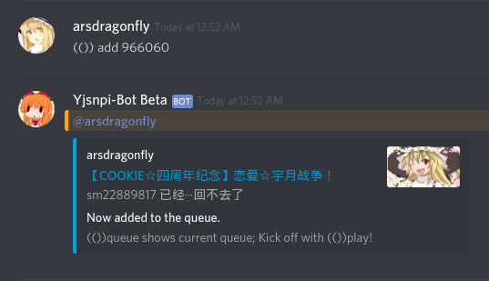

# YJSNPI Bot



This bot has absolutely no Inmu elements. (realistically)

[Click here](https://discordbots.org/bot/479293634831843328) to add this bot to your server!

Join the [Magictea Official Discord](https://discord.gg/8RVjgt4) or [author's Discord](https://discord.gg/7sWkRg2) to try it out or test latest features!

Also, check out the [Contribution Guidelines](./CONTRIBUTING.md) if you want you make Yjsnpi-bot become better!

## How to set up

Copy `config.example.ts` to `config.ts` and fill in a token obtained here:
<https://discordapp.com/developers/applications/me>

Then, install FFMpeg:
```bash
$ apt install ffmpeg
```

Then, install Annie for Bilibili access using 

```bash
$ go get github.com/iawia002/annie
```

or install Annie from here (remember to change config.ts accordingly): <https://github.com/iawia002/annie>

Next, clone the directory and run

```bash
$ npm install -g typescript
```

After installing typescript, run

```bash
$ npm install && npm run start
```

and you're ready to go.
